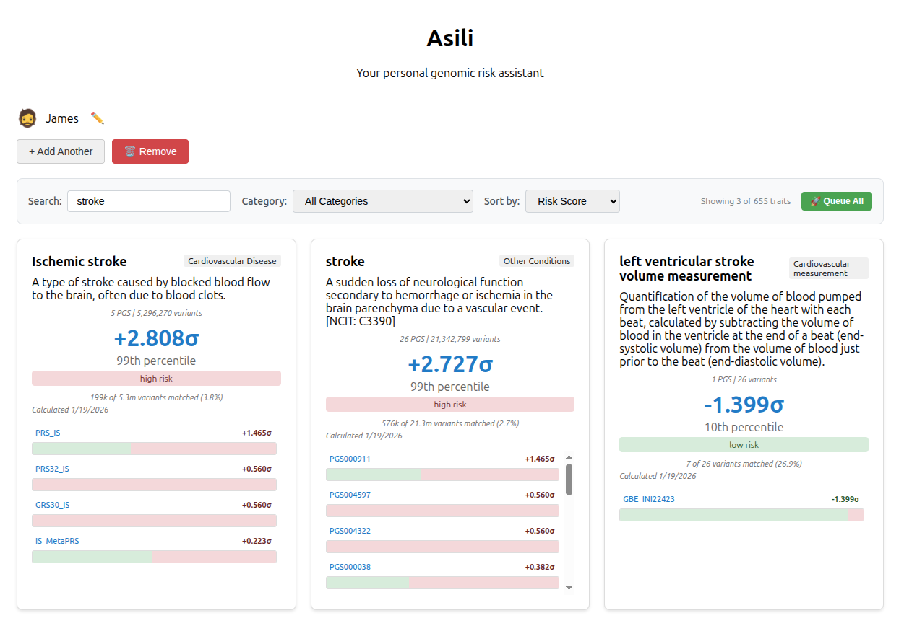

# Asili

_Swahili for "Root"_ - Your personal family genomic risk assistant that never owns your data.



## Overview

Asili is a privacy-first genomic risk analysis platform that processes DNA data entirely on your own hardware. Built on IndexedDB and DuckDB WASM architecture, it ensures your genetic information never leaves your control while providing comprehensive polygenic risk score (PGS) calculations.

## Current Architecture

### Browser-Based SPA (v1.0)

- **Frontend**: Web Components + DuckDB WASM
- **Storage**: IndexedDB for user data, DuckDB for genomic datasets
- **Processing**: Client-side JavaScript with WASM acceleration
- **Data**: Parquet files served via HTTP Range Requests
- **Privacy**: Zero-knowledge - all processing happens locally

### Deployment Options

1. **Static Hosting**: Deploy to any CDN (S3, Netlify, Vercel)
2. **Local Docker**: Single-container deployment for home servers
3. **Development**: Docker Compose with pipeline, CDN, and webapp

## Features

- **Multi-format DNA Support**: 23andMe, AncestryDNA, MyHeritage, and more
- **Family Genomics**: Manage multiple individuals with separate profiles
- **Comprehensive Traits**: 100+ polygenic risk scores from PGS Catalog
- **Real-time Processing**: WebSocket-based progress tracking
- **Hybrid Architecture**: Browser-only or server-assisted processing
- **Cache Management**: Export/import results for backup and sharing
- **Virtual Scrolling**: Smooth performance with large trait lists

## Deployment Options

### 1. Browser-Only (Static Hosting)

```bash
# Build and deploy to CDN
pnpm run build
aws s3 sync dist/ s3://your-bucket --delete
```

### 2. Hybrid Server (Recommended)

```bash
# Server-assisted processing with WebSocket updates
docker compose -f docker-compose.hybrid.yml up -d
# Access at http://localhost:4242
```

### 3. Local Development

```bash
# Full stack with pipeline
docker compose up
# Access at http://localhost:4242
```


## Contributing

### Development Setup

```bash
# Clone and install dependencies
git clone https://github.com/your-org/asili.git
cd asili
pnpm install

# Start development environment
docker compose up -d
pnpm run dev
```

### Project Structure

```
asili/
├── apps/
│   ├── web/              # Browser SPA with Web Components
│   └── calc/             # Calculation server for hybrid mode
├── packages/
│   ├── core/             # Shared genomic processing library
│   └── pipeline/         # Data ETL pipeline (PGS Catalog → Parquet)
├── data_out/             # Generated Parquet files (gitignored)
└── cache/                # PGS Catalog cache (gitignored)
```

See [CONTRIBUTING.md](CONTRIBUTING.md) for development guidelines and [PLAN.md](PLAN.md) for the project roadmap. benchmarks
- **Security Tests**: Privacy compliance and vulnerability scanning
- **Cross-Platform Tests**: Validation across browser, mobile, and server

## License

AGPLv3 License - See [LICENSE](LICENSE) for details.

**Why AGPLv3?**
- Prevents proprietary forks - anyone who modifies Asili must share their changes
- Network copyleft - if you run a modified version as a web service, you must provide source code
- Protects the community - ensures improvements benefit everyone
- Commercial use allowed - you can charge for services, but must keep code open source

**What this means:**
- ✅ Use Asili freely for personal or commercial purposes
- ✅ Modify and improve the code
- ✅ Run it as a service for others
- ❌ Create a proprietary closed-source version
- ❌ Hide your modifications from users

## Privacy Statement

Asili is designed with privacy as the foundational principle:

- **No Data Collection**: We never see, store, or transmit your genomic data
- **Local Processing**: All analysis happens on your own hardware
- **Open Source**: Full transparency in how your data is processed
- **User Control**: You own and control all data and results

Your DNA data is yours alone. Asili simply provides the tools to analyze it privately.
