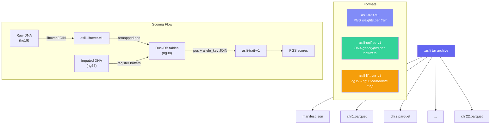

# .asili File Format Specification

Version 1.0

## Overview

`.asili` is a tar archive containing per-chromosome Parquet files and a JSON
manifest. It is designed for streaming genomic data into DuckDB WASM in the
browser — small per-chromosome files keep memory bounded while Parquet
compression and columnar layout enable fast SQL JOINs.

The format is intentionally simple: a standard POSIX tar (no gzip) wrapping
ZSTD-compressed Parquet files. Any tar reader can extract the contents.



## Structure

```
filename.asili (tar, uncompressed)
├── manifest.json          — metadata + per-chromosome file list
├── chr1.parquet           — chromosome 1 data (ZSTD compressed)
├── chr2.parquet           — chromosome 2 data
├── ...
├── chr22.parquet
├── chrX.parquet           — optional
├── chrY.parquet           — optional
└── chrMT.parquet          — optional
```

The manifest MUST be the first entry in the tar. Chromosome parquets are
sorted numerically (1-22, then X, Y, MT).

## Manifest

Every `.asili` file contains a `manifest.json` with at minimum:

```json
{
  "format": "<format-identifier>",
  "totalVariants": 12345678,
  "chromosomes": {
    "1": { "file": "chr1.parquet", "variants": 1234567 },
    "2": { "file": "chr2.parquet", "variants": 1234568 }
  },
  "createdAt": "2026-01-01T00:00:00.000Z"
}
```

The `format` field identifies the parquet schema. Additional fields vary by
format.

## Format: `asili-trait-v1`

Per-chromosome PGS catalog variant weights for a single trait.

**Filename convention:** `{trait_id}_hg38.asili`

**Parquet schema:**

| Column          | Type    | Description                                    |
| --------------- | ------- | ---------------------------------------------- |
| `variant_id`    | VARCHAR | `chr:pos:alleleA:alleleB`                      |
| `effect_allele` | VARCHAR | Allele that the weight applies to              |
| `effect_weight` | FLOAT   | PGS effect weight                              |
| `pgs_id`        | VARCHAR | PGS Catalog identifier (e.g. `PGS000001`)     |
| `chr`           | TINYINT | Chromosome number (1-22, 23=X, 24=Y, 25=MT)   |
| `pos`           | INTEGER | Genomic position (hg38)                        |
| `allele_key`    | BIGINT  | Allele hash for JOIN (see Allele Key section)  |

**Extra manifest fields:** `traitId`

## Format: `asili-unified-v1`

Per-chromosome DNA genotype data for a single individual. Contains both
directly genotyped and imputed variants. Coordinates are hg38.

**Filename convention:** `{name}_imputed.asili`

**Parquet schema:**

| Column                | Type    | Description                              |
| --------------------- | ------- | ---------------------------------------- |
| `variant_id`          | VARCHAR | `chr:pos:ref:alt`                        |
| `genotype_dosage`     | FLOAT   | Dosage of alt allele (0.0-2.0)           |
| `imputed`             | BOOLEAN | `true` if imputed, `false` if genotyped  |
| `imputation_quality`  | FLOAT   | Max genotype probability (imputed only)  |
| `chr`                 | TINYINT | Chromosome number                        |
| `pos`                 | INTEGER | Genomic position (hg38)                  |
| `allele_key`          | BIGINT  | Allele hash for JOIN                     |

**Extra manifest fields:** `individual`, `source`, `genotypedVariants`,
`imputedVariants`

**Dosage convention:** `genotype_dosage` is the count of the ALT allele
(GREATEST of the sorted allele pair). Homozygous ref = 0, heterozygous = 1,
homozygous alt = 2. Imputed values are continuous (e.g. 0.83).

## Format: `asili-liftover-v1`

Per-chromosome alignment block ranges for coordinate liftover (e.g. hg19 to
hg38). Each row represents a contiguous region where positions map linearly.

**Filename convention:** `hg19map.asili`

**Parquet schema:**

| Column        | Type    | Description                                       |
| ------------- | ------- | ------------------------------------------------- |
| `hg19_start`  | INTEGER | Inclusive start of source range                    |
| `hg19_end`    | INTEGER | Exclusive end of source range                      |
| `hg38_offset` | INTEGER | Signed offset: `pos_hg38 = pos_hg19 + hg38_offset`|

**Extra manifest fields:** `source`, `target`, `chainFile`, `schema`

**Usage:** Range JOIN to remap positions:

```sql
SELECT s.pos + l.hg38_offset AS pos_hg38
FROM dna_stage s
INNER JOIN 'liftover_chrN.parquet' l
  ON s.pos >= l.hg19_start AND s.pos < l.hg19_end
```

Positions not covered by any alignment block are unmappable and silently
dropped.

## Allele Key

Both trait and DNA parquets use `allele_key` for allele-aware JOINs. The key
is a deterministic BIGINT hash of the sorted allele pair:

```sql
('0x' || md5(
  LEAST(allele_a, allele_b) || ':' || GREATEST(allele_a, allele_b)
)[:15])::BIGINT
```

Sorting ensures that `A:G` and `G:A` produce the same key. The 15-hex-char
truncation (60 bits) avoids signed BIGINT overflow while keeping collision
probability negligible (~10⁻⁵ at 10M variants).

See `ALLELE_KEY.md` in asili-lab for the full derivation.

## Reading in the Browser

```js
// 1. Fetch the tar
const resp = await fetch('/data/trait.asili');
const buf = await resp.arrayBuffer();

// 2. Parse tar entries (512-byte headers)
const entries = parseTar(buf);

// 3. Register each parquet in DuckDB WASM
for (const e of entries) {
  if (!e.name.endsWith('.parquet')) continue;
  await db.registerFileBuffer(e.name, buf.slice(e.offset, e.offset + e.size));
}

// 4. Query with SQL
await conn.query("SELECT * FROM 'chr1.parquet' LIMIT 10");
```

## Design Rationale

- **Tar, not zip/gzip:** Tar allows random access to entries by offset.
  Individual parquets are already ZSTD-compressed internally, so outer
  compression adds overhead without benefit.
- **Per-chromosome split:** Keeps per-query working set small for WASM memory.
  A monolithic parquet for a trait with 100M+ variants causes SIGILL crashes.
- **ZSTD compression:** Best ratio-to-speed tradeoff for Parquet in DuckDB.
- **Sorted by position:** Enables efficient range scans and JOINs.
